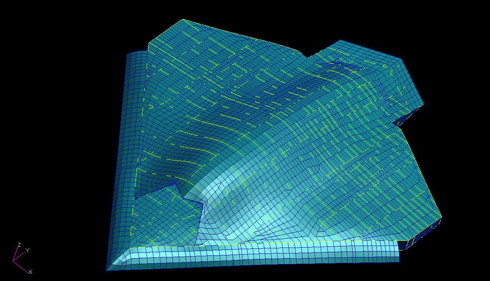

# ========================================
# CSGMIN Utility to Create Reduced Thermal System Models:
# ========================================

## CSGMIN Utility to Create Reduced Thermal System Models.

##
## I. UAV FEM First Converted to Thermal System Model with BDFUTIL Tool Prior to Reducing Thermal Model Complexity with CGSMIN Utility:

##
## II. Utility Executable: "./bin/csgmin.exe"

##
## III. Utility Input Files:
### III.a. "./input/model.sin"
    =================================
    START: "model.sin"
    =================================
    ... CONTENT REMOVED ...
       BCD 3NODE DATA
                1,   0.000000    ,  0.1688071    
                2,   0.000000    ,  0.1739401    
                3,   0.000000    ,  0.9178128E-01
                4,   0.000000    ,  0.1042977    
                5,   0.000000    ,  0.9905186E-01
                6,   0.000000    ,  0.1373899    
                7,   0.000000    ,  0.4266385E-01
                8,   0.000000    ,  0.4394694E-01
                9,   0.000000    ,  0.9722133E-01
               10,   0.000000    ,  0.1311152    
    ... CONTENT REMOVED ...
            38656, 11903, 11912,  0.8669741E-01
            38657, 11904, 11905,  0.5860869    
            38658, 11905, 11906,  0.5691764    
            38659, 11905, 11912,  0.3014298    
            38660, 11906, 11907,  0.5803693    
            38661, 11912, 11916,  0.2957662    
       END
       BCD 3CONSTANTS DATA
           DRLXCA=0.1000000E-02
           ARLXCA=0.1000000E-02
           NLOOP=5000
           SIGMA=0.5669600E-07
           TMPZRO=273.1500
       END
       BCD 3ARRAY DATA
       END
       BCD 3EXECUTION
           SNSOR 
       END
       BCD 3VARIABLES 1
       END
       BCD 3VARIABLES 2
       END
       BCD 3OUTPUT CALLS
           TPNTSN      
           PATOUT      
       END
       BCD 3END OF DATA
    =================================
    END: "model.sin"
    =================================

### III.b. "./input/convec_resis.sin"
    =================================
    START: "convec_resis.sin"
    =================================
    ... CONTENT REMOVED ...
    C     Node ID:        1     Quad/Tri Area (sq. ft.):   0.48538724     Cbar Area (sq. ft.):   0.18058668
       1000001,       1, 1000001,  1.00000000 *   0.24269362
       1000002,       1, 2000001,  1.00000000 *   0.24269362
       1000003,       1, 1000001,  1.00000000 *   0.09029334
       1000004,       1, 2000001,  1.00000000 *   0.09029334
    C
    C     Node ID:        2     Quad/Tri Area (sq. ft.):   0.45601785     Cbar Area (sq. ft.):   0.22509296
       1000005,       2, 1000002,  1.00000000 *   0.22800893
       1000006,       2, 2000002,  1.00000000 *   0.22800893
       1000007,       2, 1000002,  1.00000000 *   0.11254648
       1000008,       2, 2000002,  1.00000000 *   0.11254648
    C
    C     Node ID:        3     Quad/Tri Area (sq. ft.):   0.44607651     Cbar Area (sq. ft.):   0.08265327
       1000009,       3, 1000003,  1.00000000 *   0.22303826
       1000010,       3, 2000003,  1.00000000 *   0.22303826
       1000011,       3, 1000003,  1.00000000 *   0.04132663
       1000012,       3, 2000003,  1.00000000 *   0.04132663
    C
    C     Node ID:        4     Quad/Tri Area (sq. ft.):   0.50095564     Cbar Area (sq. ft.):   0.08275910
       1000013,       4, 1000004,  1.00000000 *   0.25047782
       1000014,       4, 2000004,  1.00000000 *   0.25047782
       1000015,       4, 1000004,  1.00000000 *   0.04137955
       1000016,       4, 2000004,  1.00000000 *   0.04137955
    C
    ... CONTENT REMOVED ...
    C
      -1011905,   68.000    , 1.0      $ Boundary Node A for Node ID:    11905
      -2011905,   68.000    , 1.0      $ Boundary Node B for Node ID:    11905
    C
      -1011906,   68.000    , 1.0      $ Boundary Node A for Node ID:    11906
      -2011906,   68.000    , 1.0      $ Boundary Node B for Node ID:    11906
    C
      -1011907,   68.000    , 1.0      $ Boundary Node A for Node ID:    11907
      -2011907,   68.000    , 1.0      $ Boundary Node B for Node ID:    11907
    C
      -1011911,   68.000    , 1.0      $ Boundary Node A for Node ID:    11911
      -2011911,   68.000    , 1.0      $ Boundary Node B for Node ID:    11911
    C
      -1011912,   68.000    , 1.0      $ Boundary Node A for Node ID:    11912
      -2011912,   68.000    , 1.0      $ Boundary Node B for Node ID:    11912
    C
    C
    =================================
    END: "convec_resis.sin"
    =================================

##
## IV. Utility Output Files:

### IV.a. "./output/out_model.sin"
    =================================
    START: "out_model.sin"
    =================================
    C START NODES DUE TO ELEMENT CONDUCTION
    C
    C               1,      70.0     ,  0.1688071E+00
                    1,      70.0     ,  -1.0
    C
    C               2,      70.0     ,  0.1739401E+00
                    2,      70.0     ,  -1.0
    C
    C               3,      70.0     ,  0.9178128E-01
                    3,      70.0     ,  -1.0
    C
    C               4,      70.0     ,  0.1042977E+00
                    4,      70.0     ,  -1.0
    C
    ... CONTENT REMOVED ...
                38655,   11901,   11902,  0.1799298E+00
                38656,   11903,   11912,  0.8669741E-01
                38657,   11904,   11905,  0.5860869E+00
                38658,   11905,   11906,  0.5691764E+00
                38659,   11905,   11912,  0.3014298E+00
                38660,   11906,   11907,  0.5803693E+00
                38661,   11912,   11916,  0.2957662E+00
    C END CONDUCTORS DUE TO ELEMENT CONDUCTION
    =================================
    END: "out_model.sin"
    =================================

### IV.b. "./output/temp.bdf"
    =================================
    START: "temp.bdf"
    =================================
    ... CONTENT REMOVED ...
     Number Sinda Nodes & Conductors:       11916       38661
 
     CSGMAX & CSGMIN:   13.18539      5.6760246E-04   23229.97    
     i_node_csg_em0_accum:         136
     i_node_csg_em1_accum:        6008
     i_node_csg_em2_accum:        5215
     i_node_csg_em3_accum:         541
     i_node_csg_em4_accum:           6
     i_node_csg_em5_accum:           0
     i_node_csg_em6_accum:           0
     i_node_csg_em7_accum:           0
     i_node_csg_em8_accum:           0
     i_node_csg_em9_accum:           0
     i_node_csg_em10_accum:           0
     Number of unique:       77314       77314
               1           1           2
     j_hold/j_hold_last:           1           0
               2           1           5
               3           1           6
               4           1        2331
               5           1        2332
               6           1        2335
               7           1        4611
               8           1        4612
               9           1        5696
              10           1        5700
              11           1        5964
              12           2           1
     j_hold/j_hold_last:           2           1
     Sub total:           1          11
    ... CONTENT REMOVED ...
                38654,   11900,   11902,  0.5114938E+00
                38655,   11901,   11902,  0.1799298E+00
                38656,   11903,   11912,  0.8669741E-01
                38657,   11904,   11905,  0.5860869E+00
                38658,   11905,   11906,  0.5691764E+00
                38659,   11905,   11912,  0.3014298E+00
                38660,   11906,   11907,  0.5803693E+00
                38661,   11912,   11916,  0.2957662E+00
    C END CONDUCTORS DUE TO ELEMENT CONDUCTION
    =================================
    END: "temp.bdf"
    =================================

